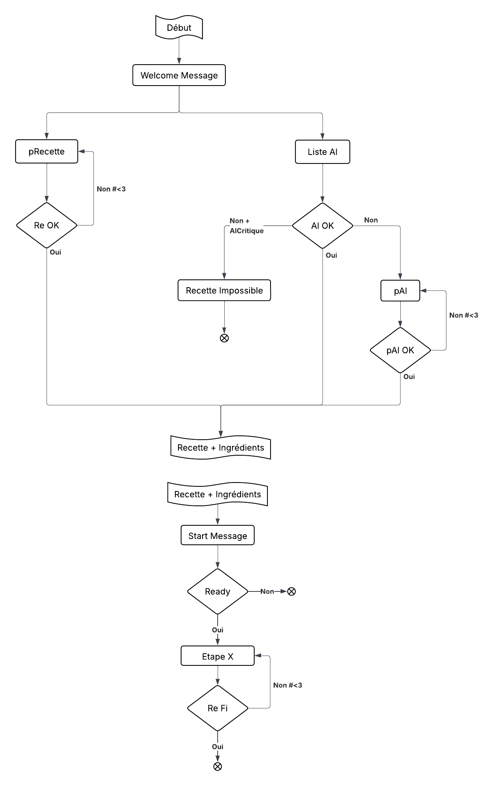

# Projet Intégration 2026 - Assistant Culinaire Intelligent

## Description

Ce projet est un assistant conversationnel intelligent conçu pour accompagner les utilisateurs en cuisine. Il combine la robustesse de **Rasa** pour la gestion du dialogue, la créativité des modèles **OpenAI (GPT)** pour la génération de recettes personnalisées, et une interface utilisateur moderne développée avec **Streamlit**.

L'application intègre des fonctionnalités avancées d'interaction vocale, permettant à l'utilisateur de dialoguer naturellement avec l'assistant (Speech-to-Text et Text-to-Speech).

## Équipe

- **Eliot PAZZÉ**
- **Alex RHODES**
- **Nelson SANCHEZ**
- **Hoang Long DUONG**

## Fonctionnalités Clés

- **Génération de Recettes** : Suggère des recettes détaillées basées sur les ingrédients fournis par l'utilisateur via l'API OpenAI.
- **Interface Vocale (Push-to-Talk)** : Permet de parler directement à l'assistant via le navigateur.
- **Synthèse Vocale (TTS)** : L'assistant peut lire les réponses à haute voix pour une expérience mains-libres en cuisine.
- **Compréhension du Langage Naturel (NLU)** : Utilise Rasa pour comprendre les intentions de l'utilisateur et gérer le contexte de la conversation.
- **Interface Web Moderne** : Une UI claire et réactive propulsée par Streamlit.

## Stack Technique

Le projet repose sur une stack Python robuste :

- **Noyau IA & NLU** : [Rasa 2.8](https://rasa.com/) (Open Source Framework)
- **Intelligence Générative** : [OpenAI API](https://openai.com/)
- **Frontend** : [Streamlit](https://streamlit.io/)
- **Gestion des Dépendances** : `uv` / `pip` (standard `pyproject.toml`)

## Structure du Projet

```
Projet-Integration-2026/
├── src/                    # Cœur du projet Rasa
│   ├── actions/            # Actions Python personnalisées (Intégration OpenAI, TTS, etc.)
│   ├── data/               # Données d'entraînement (NLU, Stories, Rules)
│   ├── models/             # Modèles Rasa entraînés (.tar.gz)
│   ├── config.yml          # Configuration du pipeline NLU et des politiques
│   ├── domain.yml          # Définition du domaine (Intents, Slots, Responses)
│   └── endpoints.yml       # Configuration des endpoints (Action Server, Tracker Store)
├── ui/                     # Application Frontend
│   ├── components/         # Composants Streamlit personnalisés (ex: Push-to-Talk)
│   └── streamlit_app.py    # Point d'entrée de l'interface graphique
├── start_rasa_with_api.ps1 # Script de démarrage automatisé (Windows)
├── pyproject.toml          # Fichier de configuration du projet et dépendances
└── main.py                 # Script utilitaire d'entrée
```

## Installation

### Prérequis
- **Python 3.8** (Version recommandée pour la compatibilité avec Rasa 2.x)
- Une clé API **OpenAI** valide.

### 1. Cloner le dépôt
```bash
git clone <url-du-repo>
cd Projet-Integration-2026
```

### 2. Configurer l'environnement virtuel
Il est fortement recommandé d'utiliser un environnement virtuel pour isoler les dépendances.

```bash
# Création venv
python -m venv .venv

# Activation (Windows)
.venv\Scripts\Activate

# Activation (Linux/Mac)
source .venv/bin/activate
```

### 3. Installer les dépendances
Le projet utilise `pyproject.toml`.

Si vous utilisez `uv` (recommandé pour la rapidité) :
```bash
uv sync
```

Sinon, avec `pip` :
```bash
pip install .
```

## Utilisation

### Entraînement Initial du Modèle (Obligatoire)
Avant de lancer l'application pour la première fois, il est impératif d'entraîner le modèle Rasa.

```bash
cd src
rasa train
```

Une fois le modèle entraîné (création d'un fichier `.tar.gz` dans `src/models/`), vous pouvez passer au démarrage.

### Démarrage Automatisé (Windows)
Un script PowerShell `start_rasa_with_api.ps1` est fourni pour lancer et orchestrer les trois services nécessaires (Serveur Rasa, Serveur d'Actions, UI Streamlit).

1. Ouvrez PowerShell.
2. Définissez votre clé API dans la première ligne du script `start_rasa_with_api.ps1` : 
    ```powershell
    $OPENAI_API_KEY = "votre-clé-sk-..."
    ```

3. Exécutez le script :
   ```powershell
   .\start_rasa_with_api.ps1
   ```

### Démarrage Manuel (Linux/Mac/Windows)
Si vous préférez lancer les services manuellement, ouvrez **3 terminaux** distincts avec l'environnement virtuel activé (`source .venv/bin/activate`).

**Terminal 1 : Serveur Rasa (API)**
```bash
cd src
$env:OPENAI_API_KEY="votre-clé"
rasa run --enable-api
```

**Terminal 2 : Serveur d'Actions Rasa**
Ce serveur gère la logique métier et les appels à OpenAI.
```bash
cd src
$env:OPENAI_API_KEY="votre-clé"
rasa run actions
```

**Terminal 3 : Interface Utilisateur**
```bash
cd ui
streamlit run streamlit_app.py
```

## Tests

TODO: Ajouter des instructions pour les tests 

## Diagramme Conversationnel



---
*Projet développé dans le cadre de la formation SRI 5A, mineure Interaction - 2026 - UPSSITECH.*


